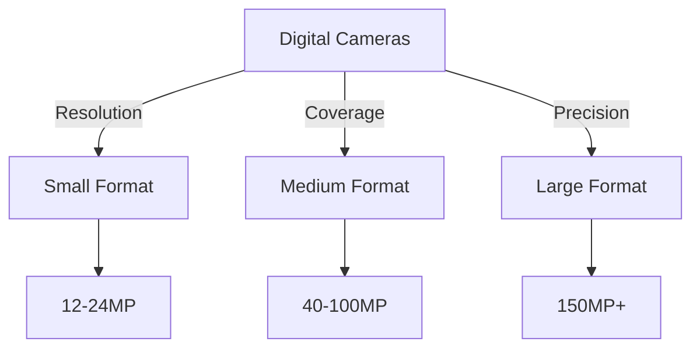
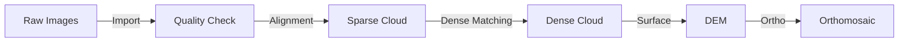

# 🛩️ Aerial Photography

## Overview

Aerial photography provides ultra-high-resolution imagery for detailed Earth observation, offering unique advantages in spatial and temporal resolution compared to satellite systems.

## Platform Types

### 🛩️ Traditional Aircraft Systems

| Platform Type | Typical Altitude | Coverage | Best For |
|--------------|------------------|----------|-----------|
| Fixed-wing | 1,000-10,000m | Large areas | Regional mapping |
| Helicopter | 300-3,000m | Medium areas | Corridor surveys |
| Gyrocopter | 300-2,000m | Small areas | Local projects |

### 🚁 UAV/Drone Systems

```
Platform Categories by Range:
Micro:     |█      | <2km    - Site surveys
Small:     |██     | 2-5km   - Local mapping
Medium:    |███    | 5-25km  - Regional coverage
Large:     |████   | >25km   - Professional surveys
```

#### Common UAV Platforms

| Type | Endurance | Payload | Applications |
|------|-----------|---------|--------------|
| Consumer (DJI) | 20-30 min | <1kg | Site surveys |
| Pro Consumer | 30-45 min | 1-2kg | Local mapping |
| Professional | 1-4 hours | 2-5kg | Large surveys |
| Industrial | 4+ hours | 5kg+ | Specialized missions |

## Sensor Systems

### 📸 Camera Types

#### Digital Sensors


| Format | Resolution | FOV | Cost | Applications |
|--------|------------|-----|------|--------------|
| Small | 12-24MP | 60-75° | $ | Site documentation |
| Medium | 40-100MP | 70-90° | $$ | Detailed mapping |
| Large | 150MP+ | 75-95° | $$$ | Professional survey |

### 🌈 Specialized Sensors

#### Multi-sensor Systems

| Sensor Type | Resolution | Bands | Applications |
|-------------|------------|-------|--------------|
| Multispectral | 1-5MP | 4-12 | Vegetation analysis |
| Hyperspectral | 1-2MP | 100+ | Detailed spectral |
| Thermal | 320x240 - 1024x768 | 1 | Temperature mapping |
| LiDAR | 100-400 pts/m² | N/A | 3D mapping |

## Mission Planning

### ✈️ Flight Planning

#### Key Parameters
```
Flight Planning Hierarchy:
1. Ground Sample Distance (GSD)
   ├── Flying height
   ├── Sensor resolution
   └── Lens focal length

2. Coverage Requirements
   ├── Forward overlap (60-80%)
   ├── Side overlap (30-60%)
   └── Survey area

3. Environmental Conditions
   ├── Sun angle
   ├── Cloud cover
   └── Wind speed
```

#### Planning Calculations

| Parameter | Formula | Typical Values |
|-----------|---------|----------------|
| GSD | (Pixel Size × Height) / Focal Length | 2-30cm |
| Swath Width | GSD × Image Width | 100-1000m |
| Base Length | (1 - Overlap) × Swath Width | 20-200m |
| Photos/Line | Survey Length / Base Length | Project specific |

### 🎯 Quality Control

1. **Pre-flight Checks**
   ```
   Essential Checks:
   □ Equipment calibration
   □ Weather conditions
   □ Flight permissions
   □ GCP setup
   □ Battery status
   □ Storage space
   ```

2. **In-flight Monitoring**
   - Real-time image quality
   - Coverage tracking
   - Navigation accuracy
   - System telemetry

## Data Processing

### 📊 Workflow Steps



### Processing Levels

| Level | Description | Products | Accuracy |
|-------|-------------|----------|----------|
| L0 | Raw data | Original images | N/A |
| L1 | Radiometric | Corrected images | Pixel-level |
| L2 | Geometric | Orthorectified | 1-2 pixels |
| L3 | Mosaic | Seamless coverage | Project spec |
| L4 | Enhanced | Value-added | Application specific |

## Applications

### 1. Mapping & Surveying
- 🗺️ **Topographic Mapping**
  ```
  Products:
  - Digital Elevation Models
  - Contour maps
  - Volume calculations
  - Feature extraction
  - Change detection
  ```

### 2. Environmental Monitoring
- 🌳 **Ecosystem Analysis**
  - Vegetation mapping
  - Habitat assessment
  - Change detection
  - Impact studies
  - Conservation planning

### 3. Infrastructure
- 🏗️ **Asset Management**
  - Inspection surveys
  - As-built documentation
  - Condition assessment
  - Planning support
  - Monitoring

## Data Management

### 📁 Storage Requirements

| Data Type | Size/Image | Project Size | Storage Type |
|-----------|------------|--------------|--------------|
| Raw Images | 50-200MB | 100GB-2TB | Local/Cloud |
| Processed | 200-500MB | 500GB-5TB | RAID/Cloud |
| Products | 1-10GB | 10-100GB | Delivery |

### 🔒 Data Security

1. **Backup Strategy**
   - Real-time backup
   - Off-site storage
   - Version control
   - Access logging

2. **Access Control**
   - User authentication
   - Role-based access
   - Audit trails
   - Encryption

## Best Practices

### 📋 Quality Guidelines

1. **Acquisition Standards**
   - GSD tolerance: ±10%
   - Overlap tolerance: ±5%
   - Maximum crab angle: 5°
   - Sun angle: >30°

2. **Processing Standards**
   - GCP accuracy: 3× GSD
   - Tie point residuals: <1 pixel
   - RMSE: <2× GSD
   - Color balance: ±5%

## Resources

### 📚 Documentation
- [ASPRS Accuracy Standards](https://www.asprs.org/publications-other/manual-of-photogrammetry)
- [UAV Regulations](https://www.faa.gov/uas)
- [Processing Guidelines](https://www.pix4d.com/manual)

### 🔧 Software Tools
- [Pix4D](https://www.pix4d.com/)
- [Agisoft Metashape](https://www.agisoft.com/)
- [DroneDeploy](https://www.dronedeploy.com/)
- [OpenDroneMap](https://www.opendronemap.org/)
