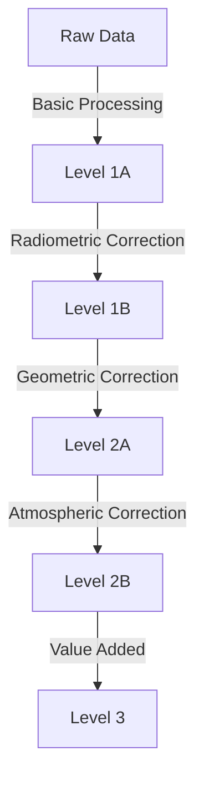

# 🛰️ Commercial Satellite Data

## Mission Overview

Commercial Earth observation satellites provide high-resolution imagery and specialized data products that complement public satellite missions. These systems offer unique capabilities for detailed monitoring and analysis.

## Satellite Operators & Systems

### 🌍 Optical Systems Overview

```
Resolution Range Distribution:
WorldView-3:  |█     | 0.31m - Highest resolution commercial
GeoEye-1:    |██    | 0.41m - High-precision mapping
SkySat:      |███   | 0.50m - Daily monitoring
SuperDove:   |████  | 3-5m  - Wide area coverage
```

### Major Optical Systems

#### 1. Maxar Technologies

| Satellite | Launch | PAN Resolution | MS Resolution | Bands | Revisit |
|-----------|--------|----------------|---------------|--------|---------|
| WorldView-3 | 2014 | 0.31m | 1.24m | 8 VNIR, 8 SWIR | 1 day |
| WorldView-2 | 2009 | 0.46m | 1.85m | 8 MS | 1.1 days |
| GeoEye-1 | 2008 | 0.41m | 1.64m | 4 MS | <3 days |

**WorldView-3 Spectral Bands**
```
Spectral Coverage:
VNIR: |████████| (8 bands)  - Surface details
SWIR: |████████| (8 bands)  - Material properties
CAVIS:|████████████| (12)   - Atmospheric correction
```

#### 2. Planet Labs

| System | Resolution | Daily Capacity | Spectral Bands | Coverage |
|--------|------------|----------------|----------------|----------|
| SkySat | 0.5m PAN, 1.0m MS | ~40 revisits/day | 4 (RGB+NIR) | Targeted |
| SuperDove | 3-5m | Global | 8 bands | Global |
| PlanetScope | 3m | Global | 4 (RGB+NIR) | Global |

### 📡 SAR Systems

#### Commercial SAR Capabilities

| Provider | Resolution | Modes | Key Features | Applications |
|----------|------------|-------|--------------|--------------|
| ICEYE | 1m | Spotlight, Strip | Frequent revisit | Maritime, Ice |
| Capella | 0.5m | Spotlight | On-demand | Infrastructure |
| Synspective | 1-3m | Strip, Sliding | Urban monitoring | Infrastructure |
| XpressSAR | 1m | Multi-mode | Maritime focus | Shipping |

## Data Products & Processing Levels

### Processing Chain


### Product Types

| Level | Description | Common Uses | Providers |
|-------|-------------|-------------|-----------|
| Basic | Radiometrically corrected | Analysis | All |
| Standard | Geometrically corrected | Mapping | All |
| Ortho | Orthorectified | GIS integration | Most |
| Enhanced | Value-added products | Specific applications | Select |

## Applications & Use Cases

### 1. Urban Monitoring
- 🏙️ **Infrastructure Analysis**
  ```
  Applications:
  - Building detection
  - Change monitoring
  - Urban growth
  - Transportation
  - Utilities mapping
  ```

### 2. Environmental Assessment
- 🌳 **Resource Monitoring**
  - Forest inventory
  - Agricultural monitoring
  - Water resource management
  - Disaster response
  - Environmental compliance

### 3. Maritime Surveillance
- 🚢 **Ocean Monitoring**
  - Ship detection
  - Port activity
  - Oil spill detection
  - Ice monitoring
  - Coastal changes

## Data Access & Integration

### 🔑 Access Methods

1. **Direct Platforms**
   - [Maxar SecureWatch](https://www.maxar.com/products/securewatch)
   - [Planet Explorer](https://www.planet.com/explorer/)
   - [ICEYE Direct](https://www.iceye.com/direct)
   - [Capella Console](https://www.capellaspace.com/console/)

2. **Cloud Platforms**
   - [UP42](https://up42.com/)
   - [SkyWatch](https://www.skywatch.com/)
   - [Sentinel Hub](https://www.sentinel-hub.com/)

### 📊 Pricing Models

| Access Type | Description | Best For | Typical Cost Range |
|-------------|-------------|----------|-------------------|
| Tasking | New acquisition | Specific needs | $$$$ |
| Archive | Historical data | Research | $$ |
| Subscription | Regular access | Monitoring | $$$ |
| Platform | API access | Integration | $$-$$$$ |

## Processing Tools & Software

### Common Tools

| Tool | Type | Best For | Key Features |
|------|------|----------|--------------|
| ENVI | Commercial | Advanced analysis | Full suite |
| eCognition | Commercial | Object detection | AI/ML |
| ERDAS | Commercial | Image processing | Comprehensive |
| QGIS | Open Source | General analysis | Free |

### API Integration
```python
# Example Planet API Usage
import planet
client = planet.Client()

# Search for imagery
query = {
    "filter": {
        "type": "AndFilter",
        "config": [
            {"type": "GeometryFilter", "field_name": "geometry", "config": aoi},
            {"type": "DateRangeFilter", "field_name": "acquired", "config": {"gte": "2024-01-01T00:00:00Z"}}
        ]
    }
}
```

## Best Practices

### 🎯 Data Selection
1. **Resolution Requirements**
   - Match resolution to application
   - Consider temporal needs
   - Evaluate spectral requirements
   - Check atmospheric conditions

2. **Quality Control**
   - Cloud cover assessment
   - Geometric accuracy
   - Radiometric quality
   - Metadata validation

## Resources

### 📚 Documentation
- [Maxar User Guides](https://www.maxar.com/resources)
- [Planet Documentation](https://developers.planet.com/docs/)
- [ICEYE SAR Guide](https://www.iceye.com/sar-data)
- [Capella User Manual](https://www.capellaspace.com/resources/)

### 🔧 Tools & SDKs
- [Planet Python SDK](https://github.com/planetlabs/planet-client-python)
- [Maxar GBDX Tools](https://github.com/DigitalGlobe/gbdxtools)
- [Commercial Data APIs](https://github.com/topics/satellite-imagery)

### 📖 References
1. Commercial Satellite Imaging Market Report
2. SAR Data Processing Guidelines
3. Remote Sensing Best Practices Guide
