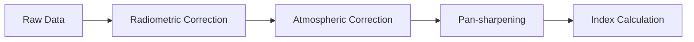

# 🛰️ Landsat

## Mission Overview

Landsat is NASA's longest-running Earth observation program, providing continuous data since 1972. Currently operational satellites:

| Satellite | Launch Date | Status | Design Life |
|-----------|-------------|---------|-------------|
| Landsat 8 | Feb 11, 2013 | Active | 5+ years |
| Landsat 9 | Sep 27, 2021 | Active | 5+ years |

Key features:
- 🌍 50+ years of continuous Earth observation
- 🕒 8-day combined revisit time (L8 & L9)
- 📸 185km x 180km scene size
- 🎯 Multiple resolution bands

## Technical Specifications

### Operational Land Imager (OLI-2) and Thermal Infrared Sensor (TIRS-2)

#### Spectral Bands

| Band | Name | Wavelength (μm) | Resolution | Purpose |
|------|------|----------------|------------|----------|
| B1 | Coastal/Aerosol | 0.433-0.453 | 30m | Coastal studies, aerosols |
| B2 | Blue | 0.450-0.515 | 30m | Bathymetry, atmosphere |
| B3 | Green | 0.525-0.600 | 30m | Peak vegetation |
| B4 | Red | 0.630-0.680 | 30m | Vegetation discrimination |
| B5 | NIR | 0.845-0.885 | 30m | Biomass content |
| B6 | SWIR-1 | 1.560-1.660 | 30m | Moisture content |
| B7 | SWIR-2 | 2.100-2.300 | 30m | Minerals, soil |
| B8 | Pan | 0.500-0.680 | 15m | Image sharpening |
| B9 | Cirrus | 1.360-1.390 | 30m | Cloud detection |
| B10 | TIR-1 | 10.6-11.2 | 100m | Surface temperature |
| B11 | TIR-2 | 11.5-12.5 | 100m | Surface temperature |

### Resolution Types

```
Spatial Resolution Overview:
15m:  |██████████████| Panchromatic
30m:  |███████      | Multispectral
100m: |██          | Thermal
```

## Data Products

### Processing Levels

| Level | Product | Description | Applications |
|-------|----------|-------------|--------------|
| L1TP | Precision Terrain | Radiometrically & geometrically corrected | Most applications |
| L1GT | Systematic Terrain | Systematic geometric corrections | Limited accuracy needs |
| L2SP | Surface Reflectance | Atmospherically corrected | Advanced analysis |
| L2ST | Surface Temperature | Calibrated thermal data | Temperature studies |

### Common Band Combinations

```
RGB Composites:
Natural Color:    B4-B3-B2
False Color IR:   B5-B4-B3
SWIR:            B7-B6-B4
Geology:         B7-B4-B2
```

## Applications

### 1. Land Cover Analysis
- 🌳 **Vegetation Studies**
    - Forest monitoring
    - Agricultural mapping
    - Biomass estimation
    - Phenology tracking

### 2. Temperature Monitoring
- 🌡️ **Surface Temperature**
    - Urban heat islands
    - Thermal anomalies
    - Fire detection
    - Permafrost studies

### 3. Change Detection
- 📊 **Long-term Analysis**
    - Urban expansion
    - Deforestation
    - Coastal changes
    - Glacier dynamics

## Common Indices

### Spectral Indices

| Index | Formula | Application |
|-------|---------|-------------|
| NDVI | (B5-B4)/(B5+B4) | Vegetation health |
| NDWI | (B3-B5)/(B3+B5) | Water bodies |
| NDBI | (B6-B5)/(B6+B5) | Built-up areas |
| NBR | (B5-B7)/(B5+B7) | Burn severity |

## Data Access and Processing

### Data Sources

1. **Official Platforms**
    - [USGS Earth Explorer](https://earthexplorer.usgs.gov/)
    - [USGS GloVis](https://glovis.usgs.gov/)
    - [USGS Machine to Machine API](https://m2m.cr.usgs.gov/)

2. **Cloud Platforms**
    - [Google Earth Engine](https://earthengine.google.com/)
    - [AWS Open Data](https://registry.opendata.aws/landsat-8/)
    - [Microsoft Planetary Computer](https://planetarycomputer.microsoft.com/)

### Processing Tools

| Tool | Type | Features | Best For |
|------|------|----------|-----------|
| QGIS | Desktop | Full GIS suite | General analysis |
| SNAP | Desktop | Advanced processing | Scientific analysis |
| GEE | Cloud | Large-scale processing | Big data analysis |
| LandSat Package | Python | Automated processing | Custom workflows |

## Processing Workflow

### 1. Pre-processing Steps


### 2. Best Practices
- ☁️ **Quality Control**
    - Use QA bands
    - Check cloud cover
    - Validate results
- 🎯 **Processing Tips**
    - Apply TOA correction
    - Consider atmospheric effects
    - Use appropriate resampling

## Historical Archive

### Timeline of Landsat Missions

```
1972 ────── 1984 ────── 1999 ────── 2013 ────── 2021
   L1         L5          L7          L8          L9
```

Key milestones:
- 1972: First civilian Earth observation satellite
- 1984: Introduction of TM sensor
- 1999: Enhanced capabilities with ETM+
- 2013: OLI and TIRS sensors
- 2021: Latest generation sensors

## Resources

### Documentation
- [Landsat Science](https://landsat.gsfc.nasa.gov/)
- [USGS Landsat Missions](https://www.usgs.gov/landsat-missions)
- [Landsat Collection 2](https://www.usgs.gov/landsat-missions/landsat-collection-2)

### Scientific References
1. Landsat 8-9 Data Users Handbook
2. Collection 2 Algorithm Description
3. Surface Reflectance Code (LaSRC)
