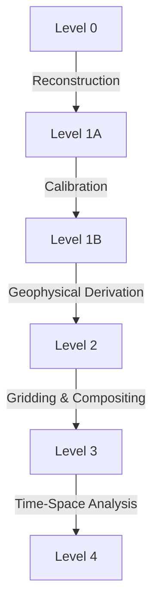

# 🛰️ MODIS (Moderate Resolution Imaging Spectroradiometer)

## Mission Overview

MODIS is a key instrument aboard the Terra (EOS AM) and Aqua (EOS PM) satellites, providing daily global coverage of Earth's surface and atmosphere. 

| Satellite | Launch Date | Equator Crossing | Status |
|-----------|-------------|------------------|---------|
| Terra | Dec 18, 1999 | 10:30 AM | Active |
| Aqua | May 4, 2002 | 1:30 PM | Active |

Key features:
- 🌍 Global coverage every 1-2 days
- 📊 36 spectral bands
- 🎯 Multiple spatial resolutions (250m, 500m, 1km)
- 🕒 20+ years of continuous data

## Technical Specifications

### Spectral and Spatial Characteristics

#### Resolution Overview
```
Spatial Resolution Distribution:
250m: |██      | (2 bands)    - Land/Cloud/Aerosols Boundaries
500m: |████    | (5 bands)    - Land/Cloud/Aerosols Properties
1km:  |██████| (29 bands)   - Ocean Color/Phytoplankton/Biogeochemistry
```

#### Key Spectral Bands

| Resolution | Band Range | Primary Use | Key Applications |
|------------|------------|-------------|------------------|
| 250m | 1-2 | Land/Cloud/Aerosols Boundaries | Vegetation mapping |
| 500m | 3-7 | Land/Cloud/Aerosols Properties | Surface reflectance |
| 1km | 8-36 | Ocean Color/Atmosphere/Temperature | Ocean & atmosphere |

### Product Categories

## 📦 MODIS Products

### 1. Land Products (MOD/MYD)

| Product | Code | Resolution | Frequency | Description |
|---------|------|------------|-----------|-------------|
| Surface Reflectance | MOD09 | 250m-1km | Daily/8-day | Atmospherically corrected |
| Land Surface Temperature | MOD11 | 1km | Daily/8-day | Surface temperature |
| Vegetation Indices | MOD13 | 250m-1km | 16-day | NDVI & EVI |
| Land Cover | MCD12Q1 | 500m | Yearly | Land cover types |
| Snow Cover | MOD10 | 500m | Daily | Snow presence |
| BRDF/Albedo | MCD43 | 500m | Daily | Surface reflectance |

### 2. Atmosphere Products

| Product | Code | Resolution | Key Parameters |
|---------|------|------------|----------------|
| Aerosol | MOD04 | 10km | Aerosol optical depth |
| Clouds | MOD06 | 1km | Cloud properties |
| Atmospheric Profiles | MOD07 | 5km | Temperature/moisture |
| Water Vapor | MOD05 | 1km | Column water vapor |

### 3. Cryosphere Products

| Product | Code | Resolution | Parameters |
|---------|------|------------|------------|
| Sea Ice | MOD29 | 1km | Extent & temperature |
| Snow Cover | MOD10 | 500m | Coverage & albedo |
| Ice Surface Temp | MOD11 | 1km | Surface temperature |

## Data Access & Processing

### 🔍 Data Sources

1. **Official Platforms**
   - [NASA LAADS DAAC](https://ladsweb.modaps.eosdis.nasa.gov/)
   - [NSIDC DAAC](https://nsidc.org/data/modis/)
   - [LP DAAC](https://lpdaac.usgs.gov/)

2. **Cloud Platforms**
   - [Google Earth Engine](https://developers.google.com/earth-engine/datasets/catalog/modis)
   - [NASA Earthdata Cloud](https://earthdata.nasa.gov/eosdis/cloud-evolution)
   - [AWS Open Data](https://registry.opendata.aws/)

### 🛠️ Processing Levels



| Level | Description | Common Uses |
|-------|-------------|-------------|
| L1A | Raw radiances | Calibration |
| L1B | Calibrated radiances | Atmospheric studies |
| L2 | Geophysical variables | Surface properties |
| L3 | Gridded composites | Time series analysis |
| L4 | Model outputs | Climate studies |

## Common Applications

### 1. Climate Studies
- 🌡️ **Temperature Monitoring**
  - Surface temperature trends
  - Urban heat islands
  - Thermal anomalies

### 2. Vegetation Analysis
- 🌳 **Ecosystem Monitoring**
  - Phenology tracking
  - Biomass estimation
  - Forest change detection

### 3. Cryosphere Research
- ❄️ **Snow and Ice**
  - Sea ice extent
  - Snow cover mapping
  - Glacier monitoring

## Processing Workflow

### Best Practices

1. **Quality Control**
   ```
   Data Quality Steps:
   1. Check QA flags
   2. Apply scale factors
   3. Filter cloud pixels
   4. Validate results
   ```

2. **Processing Tips**
   - Always check quality flags
   - Consider viewing geometry
   - Apply appropriate masks
   - Use temporal composites

### Common Indices

| Index | Formula | Application |
|-------|---------|-------------|
| NDVI | (NIR-Red)/(NIR+Red) | Vegetation health |
| EVI | 2.5*(NIR-Red)/(NIR+6*Red-7.5*Blue+1) | Enhanced vegetation |
| NDSI | (Green-SWIR)/(Green+SWIR) | Snow detection |
| LST | Algorithm based | Temperature |

## Tools and Software

| Tool | Type | Best For | Key Features |
|------|------|----------|--------------|
| MODIS Reprojection Tool | Desktop | Data preparation | Reprojection & mosaicking |
| PyMODIS | Python | Automation | Processing & analysis |
| MODIS Land QA Tools | Desktop | Quality analysis | QA interpretation |
| AppEEARS | Web | Time series | Point & area analysis |

## Resources

### 📚 Documentation
- [MODIS Overview](https://modis.gsfc.nasa.gov/about/)
- [Product User Guides](https://lpdaac.usgs.gov/products/mcd12q1v006/)
- [Algorithm Theoretical Basis Documents](https://modis.gsfc.nasa.gov/data/atbd/)

### 🔧 Tools & Utilities
- [MODIS Reprojection Tool](https://lpdaac.usgs.gov/tools/modis_reprojection_tool/)
- [MODIS Tools GitHub](https://github.com/NASA-IMPACT/modis-tools)
- [Google Earth Engine MODIS Guide](https://developers.google.com/earth-engine/datasets/catalog/modis)

### 📖 References
1. MODIS Science Team Publications
2. MODIS Land Team Validation
3. MODIS Atmosphere Team Validation
