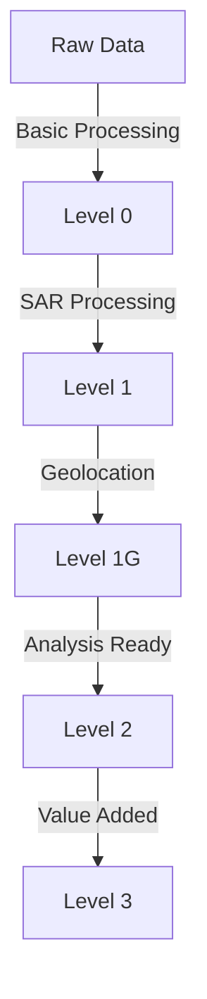

# 🛰️ RADARSAT

## Mission Overview

RADARSAT represents Canada's flagship Earth observation program, utilizing advanced Synthetic Aperture Radar (SAR) technology. The current operational systems include RADARSAT-2 and the RADARSAT Constellation Mission (RCM).

| Parameter | RADARSAT-2 | RCM (3 Satellites) |
|-----------|------------|-------------------|
| Launch Date | Dec 14, 2007 | Jun 12, 2019 |
| Status | Operational | Operational |
| Orbit Altitude | 798 km | 592.7 km |
| Design Life | 7+ years | 7 years |
| Mass | 2,200 kg | 1,430 kg each |
| Revisit Time | 24 days | 4 days |

Key features:
- 🌍 All-weather, day/night imaging capability
- 📡 C-band SAR (5.405 GHz)
- 🎯 Multiple resolution modes (1m to 100m)
- 🕒 Sub-daily Arctic coverage

## Technical Specifications

### Imaging Modes Overview

```
Resolution Range Distribution:
Spotlight:     |█      | 1x1m     - Precise monitoring
Ultra-Fine:    |██     | 3x3m     - Urban/Coastal
Fine:          |███    | 8x8m     - Land mapping
Standard:      |████   | 25x25m   - General purpose
Wide:          |█████  | 30x30m   - Maritime
ScanSAR:       |██████ | 100x100m - Ice monitoring
```

### Imaging Modes Details

#### RADARSAT-2

| Mode | Resolution | Swath Width | Polarization | Applications |
|------|------------|-------------|--------------|--------------|
| Spotlight | 1 x 1 m | 18 km | Single, Dual | Infrastructure |
| Ultra-Fine | 3 x 3 m | 20 km | Single | Urban mapping |
| Wide Ultra-Fine | 3 x 3 m | 50 km | Single | Coastal zones |
| Fine | 8 x 8 m | 50 km | Quad-pol | Land use |
| Standard | 25 x 25 m | 100 km | Quad-pol | General purpose |
| Wide | 30 x 30 m | 150 km | Single, Dual | Maritime |
| ScanSAR | 100 x 100 m | 500 km | Single, Dual | Ice coverage |

#### RADARSAT Constellation Mission (RCM)

| Mode | Resolution | Swath Width | Polarization | Key Use |
|------|------------|-------------|--------------|---------|
| Very High | 1 x 3 m | 20 km | Single | Infrastructure |
| High | 3 x 9 m | 50 km | Dual | Coastal |
| Medium | 16 x 30 m | 125 km | Quad | Wide area |
| Low | 50 x 50 m | 350 km | Compact | Maritime |
| Very Low | 100 x 100 m | 500 km | Single | Ice extent |

## Data Products

### Processing Levels



| Level | Product Type | Description | Common Uses |
|-------|-------------|-------------|-------------|
| Level 0 | Raw Data | Compressed raw data | Archive |
| Level 1 | SLC | Single Look Complex | InSAR |
| Level 1G | GRD | Ground Range Detected | Analysis |
| Level 2 | Analysis Ready | Calibrated, geocoded | Applications |
| Level 3 | Value Added | Derived products | End users |

## Applications

### 1. Maritime Surveillance
- 🚢 **Ship Detection**
  - Automatic identification
  - Route tracking
  - Port monitoring
  - Illegal activity detection

### 2. Ice Monitoring
- ❄️ **Sea Ice Analysis**
  ```
  Key Parameters:
  - Ice concentration
  - Ice type classification
  - Lead detection
  - Ridge mapping
  - Motion tracking
  ```

### 3. Land Applications
- 🌍 **Surface Monitoring**
  - Deformation mapping
  - Urban change detection
  - Agricultural monitoring
  - Forest mapping

## Processing Workflow

### SAR Processing Chain

1. **Pre-processing**
   ```
   Processing Steps:
   1. Radiometric calibration
   2. Speckle filtering
   3. Terrain correction
   4. Geocoding
   ```

2. **Analysis Techniques**
   - Polarimetric analysis
   - Interferometric processing
   - Change detection
   - Feature extraction

### Common Analysis Methods

| Technique | Parameters | Applications |
|-----------|------------|--------------|
| InSAR | Phase difference | Deformation |
| PolSAR | Polarimetric | Classification |
| Backscatter | Intensity | Change detection |
| Coherence | Phase stability | Feature stability |

## Data Access & Tools

### 🔍 Data Sources

1. **Official Platforms**
   - [EODMS](https://www.eodms-sgdot.nrcan-rncan.gc.ca/)
   - [MDA GSI](https://www.maxar.com/products/satellite-access)
   - [ASF DAAC](https://asf.alaska.edu/)

2. **Commercial Access**
   - MDA Direct
   - Regional distributors
   - Value-added providers

### 🛠️ Processing Software

| Tool | Type | Best For | Key Features |
|------|------|----------|--------------|
| SNAP | Desktop | General processing | Full SAR toolkit |
| GAMMA | Commercial | InSAR | Professional |
| ISCE | Open source | Research | Advanced InSAR |
| PyRAT | Python | Custom processing | Automation |

## Best Practices

### Processing Tips
- 📊 **Quality Control**
  - Check orbit data quality
  - Apply precise calibration
  - Consider environmental conditions
  - Validate results

### Common Challenges
```
Key Considerations:
1. Speckle noise reduction
2. Geometric distortions
3. Atmospheric effects
4. Temporal decorrelation
```

## Resources

### 📚 Documentation
- [RADARSAT-2 Product Description](https://www.asc-csa.gc.ca/eng/satellites/radarsat2/)
- [RCM User Guide](https://www.asc-csa.gc.ca/eng/satellites/radarsat/)
- [Technical Documentation](https://www.asc-csa.gc.ca/eng/satellites/technical-documents.asp)

### 🔧 Tools & Utilities
- [ASF Tools](https://asf.alaska.edu/data-tools/)
- [ESA SNAP Toolbox](https://step.esa.int/main/toolboxes/snap/)
- [Custom Processing Scripts](https://github.com/topics/radarsat)

### 📖 References
1. RADARSAT-2 Product Format Definition
2. RCM Product Description
3. SAR Processing Handbook
