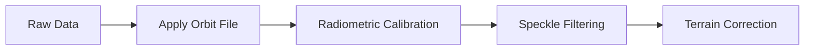

# 🛰️ Sentinel-1

## Mission Overview

Sentinel-1 is a radar imaging mission of the European Union's Copernicus Programme, consisting of two identical satellites:

| Satellite | Launch Date | Status | Orbit |
|-----------|-------------|---------|--------|
| Sentinel-1A | April 3, 2014 | Active | Sun-synchronous |
| Sentinel-1B | April 25, 2016 | Decommissioned (2022) | Sun-synchronous |

Key features:
- 🌍 Global coverage every 6 days
- 🌙 Day and night operation
- ☔ All-weather imaging
- 📡 C-band SAR technology

## Technical Specifications

### SAR Instrument

| Parameter | Specification |
|-----------|--------------|
| Frequency Band | C-band (5.405 GHz) |
| Wavelength | 5.6 cm |
| Polarization | VV+VH, HH+HV |
| Incidence Angle | 20° - 45° |
| Orbit Height | 693 km |

### Acquisition Modes

```
Swath Width Comparison:
SM:   80km  |-------|
IW:   250km |------------------------|
EW:   400km |----------------------------------|
WV:   20km  |-|  (sampled every 100km)
```

#### 1. Interferometric Wide Swath (IW)
- **Primary mode over land**
- Resolution: 5 x 20 m
- Swath width: 250 km
- TOPS imaging technique
- Three sub-swaths

#### 2. Strip Map (SM)
- Resolution: 5 x 5 m
- Swath width: 80 km
- Continuous imaging
- Single look complex

#### 3. Extra Wide Swath (EW)
- Resolution: 20 x 40 m
- Swath width: 400 km
- Maritime monitoring
- Five sub-swaths

#### 4. Wave Mode (WV)
- Resolution: 5 x 20 m
- Vignette size: 20 x 20 km
- Ocean applications
- Alternating incidence angles

## Data Products

### Processing Levels

| Level | Product | Description | Applications |
|-------|----------|-------------|--------------|
| Level-0 | Raw | Raw SAR data | Advanced processing |
| Level-1 SLC | Single Look Complex | Complex samples, phase preserved | InSAR, polarimetry |
| Level-1 GRD | Ground Range Detected | Multi-looked, projected | Most applications |
| Level-2 OCN | Ocean | Wind, wave height, currents | Maritime monitoring |

### Polarization Options

```
VV: Vertical transmit - Vertical receive
VH: Vertical transmit - Horizontal receive
HH: Horizontal transmit - Horizontal receive
HV: Horizontal transmit - Vertical receive
```

## Applications

### 1. Permafrost Monitoring
- 📊 **Surface Deformation**
    - InSAR time series analysis
    - Seasonal movement tracking
    - Subsidence mapping
- 🏗️ **Infrastructure Stability**
    - Pipeline monitoring
    - Building deformation
    - Road network assessment

### 2. Maritime Surveillance
- 🚢 **Vessel Detection**
    - Ship position tracking
    - Traffic monitoring
    - Security applications
- 🌊 **Ocean Monitoring**
    - Wave height estimation
    - Wind field mapping
    - Oil spill detection

### 3. Emergency Response
- 🌊 **Flood Mapping**
    - Rapid damage assessment
    - Extent mapping
    - Time series monitoring
- 🌋 **Natural Disasters**
    - Earthquake damage
    - Volcanic activity
    - Landslide detection

## Data Access and Processing

### Data Sources

1. **Official Platforms**
    - [Copernicus Open Access Hub](https://scihub.copernicus.eu/)
    - [Alaska Satellite Facility](https://asf.alaska.edu/)
    - [Sentinel Hub](https://www.sentinel-hub.com/)

2. **Cloud Platforms**
    - [Google Earth Engine](https://earthengine.google.com/)
    - [AWS Registry of Open Data](https://registry.opendata.aws/)
    - [Microsoft Planetary Computer](https://planetarycomputer.microsoft.com/)

### Processing Tools

| Tool | Type | Features | Best For |
|------|------|----------|-----------|
| SNAP | Desktop | Complete processing suite | General processing |
| GAMMA | Commercial | Advanced InSAR | Professional InSAR |
| ISCE | Open-source | Scientific processing | Research |
| GEE | Cloud | Large-scale processing | Big data analysis |

## Processing Workflow

### 1. Pre-processing


### 2. Analysis Methods
- 📊 **Change Detection**
    - Amplitude-based
    - Coherence-based
    - Time series analysis
- 🗺️ **InSAR Processing**
    - Differential InSAR
    - Persistent Scatterers
    - SBAS technique

## Best Practices

### Data Selection
- ✅ Choose appropriate acquisition mode
- ✅ Consider temporal baseline
- ✅ Check orbit direction
- ✅ Verify polarization

### Processing Tips
- 🔍 Use precise orbit files
- 🌍 Apply terrain correction
- 🔧 Optimize speckle filtering
- 📏 Validate results

## Resources

### Documentation
- [ESA Sentinel Online](https://sentinel.esa.int/web/sentinel/missions/sentinel-1)
- [Copernicus User Guide](https://sentinels.copernicus.eu/web/sentinel/user-guides/sentinel-1-sar)
- [SNAP Tutorials](https://step.esa.int/main/doc/tutorials/)

### Scientific References
1. ESA Sentinel-1 Handbook
2. SAR Principles and Applications
3. InSAR Processing Guidelines
