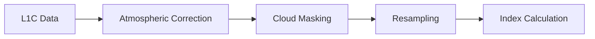

# 🛰️ Sentinel-2

## Mission Overview

Sentinel-2 is a high-resolution optical imaging mission of the European Union's Copernicus Programme, consisting of two identical satellites:

| Satellite | Launch Date | Status | Orbit |
|-----------|-------------|---------|--------|
| Sentinel-2A | June 23, 2015 | Active | Sun-synchronous |
| Sentinel-2B | March 7, 2017 | Active | Sun-synchronous |

Key features:
- 🌍 Global coverage every 5 days
- ☀️ High-resolution optical imaging
- 🌈 13 spectral bands
- 📸 290km swath width

## Technical Specifications

### Multi-Spectral Instrument (MSI)

#### Spectral Bands

| Band | Central λ (nm) | Resolution | Purpose |
|------|----------------|------------|---------|
| B1 | 443 | 60m | Aerosol detection |
| B2 | 490 | 10m | Blue |
| B3 | 560 | 10m | Green |
| B4 | 665 | 10m | Red |
| B5 | 705 | 20m | Red Edge 1 |
| B6 | 740 | 20m | Red Edge 2 |
| B7 | 783 | 20m | Red Edge 3 |
| B8 | 842 | 10m | NIR |
| B8A | 865 | 20m | NIR narrow |
| B9 | 940 | 60m | Water vapor |
| B10 | 1375 | 60m | Cirrus |
| B11 | 1610 | 20m | SWIR 1 |
| B12 | 2190 | 20m | SWIR 2 |

### Resolution Types

```
Spatial Resolution Overview:
10m: |██████████| RGB + NIR
20m: |█████     | Red Edge + SWIR
60m: |█         | Atmospheric
```

#### 1. 10m Resolution Bands
- Perfect for:
    - Land cover mapping
    - Urban planning
    - Agriculture monitoring
    - Basic vegetation indices

#### 2. 20m Resolution Bands
- Ideal for:
    - Advanced vegetation analysis
    - Soil moisture
    - Snow/ice discrimination
    - Mineral mapping

#### 3. 60m Resolution Bands
- Designed for:
    - Atmospheric correction
    - Cloud screening
    - Cirrus detection

## Data Products

### Processing Levels

| Level | Product | Description | Applications |
|-------|----------|-------------|--------------|
| Level-1C | TOA Reflectance | Orthorectified, TOA reflectance | Most applications |
| Level-2A | BOA Reflectance | Atmospherically corrected | Advanced analysis |

### Common Band Combinations

```
RGB Composites:
Natural Color:    B4-B3-B2
False Color IR:   B8-B4-B3
Agriculture:      B11-B8-B4
Vegetation:       B8-B11-B4
```

## Applications

### 1. Vegetation Monitoring
- 🌱 **Agriculture**
    - Crop type mapping
    - Growth monitoring
    - Yield estimation
    - Irrigation management
- 🌳 **Forestry**
    - Forest cover mapping
    - Deforestation detection
    - Health assessment
    - Biomass estimation

### 2. Environmental Monitoring
- 🏙️ **Urban**
    - Land use mapping
    - Urban growth
    - Green space monitoring
- 💧 **Water**
    - Water body mapping
    - Quality assessment
    - Coastal monitoring

### 3. Disaster Response
- 🌊 **Flood Mapping**
    - Extent assessment
    - Damage evaluation
    - Recovery monitoring
- 🔥 **Fire Impact**
    - Burn scar mapping
    - Vegetation recovery
    - Risk assessment

## Common Indices

### Vegetation Indices

| Index | Formula | Application |
|-------|---------|-------------|
| NDVI | (B8-B4)/(B8+B4) | General vegetation |
| NDWI | (B3-B8)/(B3+B8) | Water content |
| SAVI | 1.5*(B8-B4)/(B8+B4+0.5) | Sparse vegetation |
| EVI | 2.5*(B8-B4)/(B8+6*B4-7.5*B2+1) | Enhanced vegetation |

## Data Access and Processing

### Data Sources

1. **Official Platforms**
    - [Copernicus Open Access Hub](https://scihub.copernicus.eu/)
    - [Copernicus Data Space](https://dataspace.copernicus.eu/)
    - [USGS Earth Explorer](https://earthexplorer.usgs.gov/)

2. **Cloud Platforms**
    - [Google Earth Engine](https://earthengine.google.com/)
    - [AWS Registry of Open Data](https://registry.opendata.aws/)
    - [Microsoft Planetary Computer](https://planetarycomputer.microsoft.com/)

### Processing Tools

| Tool | Type | Features | Best For |
|------|------|----------|-----------|
| SNAP | Desktop | Complete processing suite | General processing |
| Sen2Cor | Desktop | L2A generation | Atmospheric correction |
| GEE | Cloud | Large-scale processing | Big data analysis |
| QGIS | Desktop | Visualization & analysis | GIS integration |

## Processing Workflow

### 1. Pre-processing Steps


### 2. Best Practices
- ☁️ **Cloud Handling**
    - Use cloud masks
    - Check quality bands
    - Consider seasonal patterns
- 🎯 **Accuracy**
    - Validate results
    - Use ground truth
    - Consider atmospheric effects

## Resources

### Documentation
- [ESA Sentinel Online](https://sentinel.esa.int/web/sentinel/missions/sentinel-2)
- [User Guides](https://sentinels.copernicus.eu/web/sentinel/user-guides/sentinel-2-msi)
- [SNAP Tutorials](https://step.esa.int/main/doc/tutorials/)

### Scientific References
1. ESA Sentinel-2 Handbook
2. MSI Instrument Guide
3. L2A Algorithm Theoretical Basis
